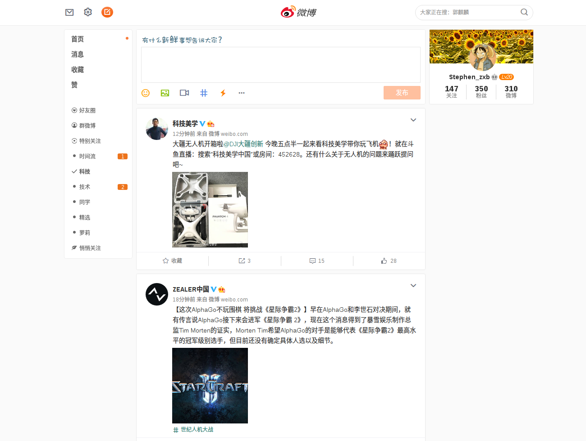

# Flat Weibo

这是一个使微博网页版更加纯净的 Chrome 插件

### 预览

### 下载 & 安装

[Chrome 应用商店](https://chrome.google.com/webstore/detail/flat-weibo/plmimfmefmleomdhkjabaiphhfdnobop)

[百度云](http://pan.baidu.com/s/1miEOqJe)

由于 Chrome 目前禁止第三方插件的手动安装，所以需在 Chrome 里依次点击 **菜单** **更多工具** **扩展程序** 然后打开 **开发者模式**，将插件拖进来然后会自动安装。

安装成功后插件即生效，更多自定义功能稍后便来 ~

### 开发 & 构建

#### 安装依赖

`npm install`

#### 开发

`npm run dev`

#### 构建

`npm run build`
